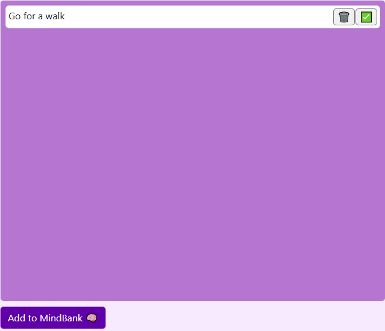

# MindHaven

## User Story
```
AS A MindHaven user
I WANT to set and track personalized mindfulness goals 
SO THAT I can improve my daily mindfulness 
```
## Description

We wanted to create a website that will aid people who want to be more mindful and keep their thoughts and goals in a centralized location. As life goes on it becomes difficult to stay mindful and keep track of how you are feeling throughout the day. MindHaven can be used while you are out and about or do not have dedicated time to an analog tracking method. Reminders can also help you stay goal oriented and keep track of your progress. The calming colors and intuitive design allow users to stay engaged but not overwhelmed. Learning how to collaborate through GitHub and implement Bootstrap for the first time was challenging, but resulted in a higher quality end product.

Future development for MindHaven could include the ability to share your MindBank and log through social media or email, implementing media elements like videos, podcasts, or music. Or tracking your progress through daily mindfulness activities and goals.

## Usage

When users first open MindHaven they will see an intro Modal that will allow them to start entering in their MindBank immediately, or take their time to see all the features within MindHaven.


After, users can add activities or goals to their MindBank and check them off when they are completed.


When users want to keep track of their thoughts or make comments about certain activities they can use the log to create dated entries.


There are timed reminders that will show up to keep the user on track.


## License

MIT License

## Credits

Levi Frandsen https://github.com/LeviOP

Kassandra Peasley https://github.com/observingkas

Caitlyn Burk https://github.com/cburk9

Erin Matlock https://github.com/Ematlock99

Zaal Khazraeinazmpour https://github.com/zaalk97

